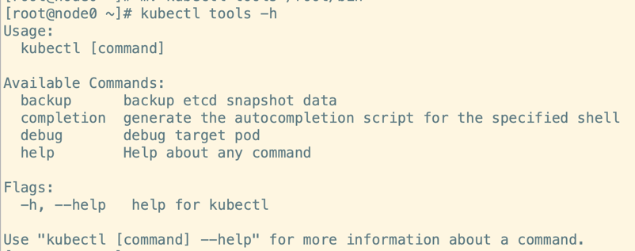
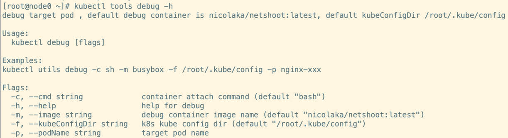
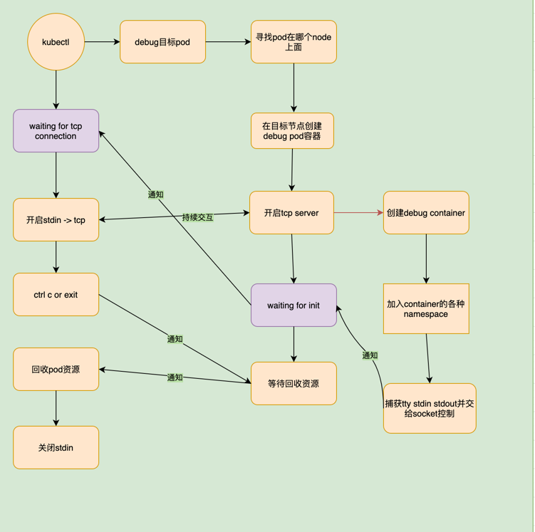
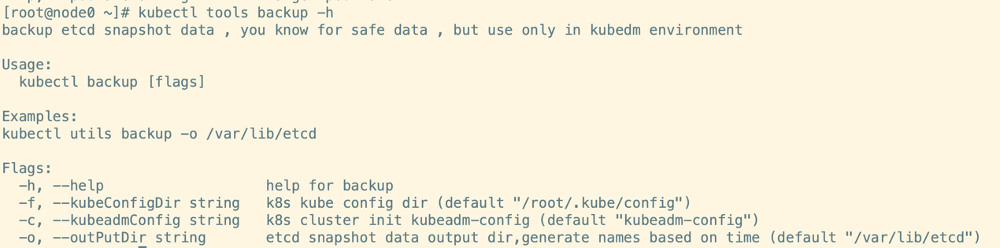

# kubectl-tools

这是一款kubectl的工具集合，未来会集成一些好用的功能

## 使用方法

kubernetes版本 > 1.12 + 

进入kubernetes目录 使用交叉编译打包为linux平台的包，将生成的kubectl-tools可执行文件放入k8s集群master节点的/root/bin目录下（kubectl plugin list）
```shell
cd kubernetes
CGO_ENABLED=0 GOOS=linux GOARCH=amd64  go build -o kubectl-tools
```
使用 kubectl tools -h 即可查看帮助




目前提供的功能

1. debug,提供一个带工具的容器，加入到目标容器的namespace中，在相同的视图下进行诊断





2. etcd集群备份 仅支持kubeadm安装的集群，使用前可以先使用下面的命令查看对应cm中是否存在etcd配置信息，包含ca证书和节点等
```shell
kubectl describe cm kubeadm-config -n kube-system
```

```shell
[root@node0 ~]# kubectl tools backup -o /usr
Snapshot saved at /usr/2021.09.03-04:37:56-etcd-snapshot.db
```


debug实现思路参考 https://aleiwu.com/post/kubectl-debug-intro/