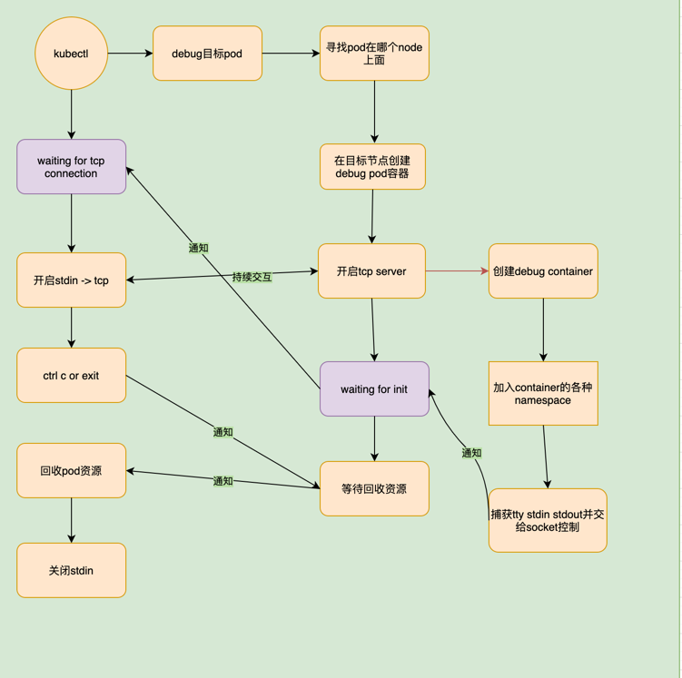

# kubectl-tools

这是一款kubectl的工具集合，未来会集成一些好用的功能

目前提供的功能

1. debug,提供一个带工具的容器，加入到目标容器的namespace中，在相同的视图下进行诊断




2. etcd集群备份 仅支持kubeadm安装的集群，使用前可以先使用下面的命令查看对应cm中是否存在etcd配置信息，包含ca证书和节点等
```shell
kubectl describe cm kubeadm-config -n kube-system
```


debug实现思路参考 https://aleiwu.com/post/kubectl-debug-intro/